## **Protectionism in the "AI Arms Race" - Using Large Language Models to Analyze the Prevalence of Protectionist Policies for Artificial Intelligence**
This is a project **still under development**, part of a thesis for a Master's Degree at Fundação Getulio Vargas (FGV EAESP)

## **1) Introduction**
There has been a perceptible uptick in global interest in two different, but complementary, topics: artificial intelligence (AI) and economic nationalism. AI has been, during the past decade, one of the most discussed technologies in the world. From the 2010’s novel applications of deep and reinforcement learning to the recent innovation brought forth by large language models (GPT and other transformer architectures), the world’s eyes are paying close attention to the development of this technology. Not only are markets deploying valuable resources to develop and adopt it, but governments have also taken considerable efforts to regulate and foster the artificial intelligence environment - semiconductors, data infrastructure, machine learning models, and its applications - foreseeing the potential risks and gains of such a ubiquitous technology. 

At the same time, the world has seen the rise of economic nationalism and how it reshaped global trade dynamics. Economic nationalism is marked by policies prioritizing domestic industries over international cooperation, such as Trump's intentions to impose widespread tariffs on imports, or the CHIPS Act, which subsidizes the U.S. semiconductor industry. These policies challenge decades of efforts to promote liberal trade. Simultaneously, international organizations like the World Trade Organization (WTO) have faced criticism for their inability to adapt to new economic realities or mediate disputes effectively. This failure has undermined trust in multilateral trade frameworks, prompting nations to pursue unilateral strategies that reflect growing skepticism toward globalization and free trade principles.

Both topics are now converging under the umbrella of the New Techno-nationalist movement. For this movement, the nation and its technologies must be defended through “protectionism measures, domestically supported manufacturing and technology, the rejection of multilateralism, the deployment of zero-sum narratives, and in some circumstances, ethnic discrimination”[1]. Such an argument contrasts with the liberal notions of free trade, international cooperation, and multiculturalism that made up much of the economic arguments of the last decades. 

Thus, the convergence of artificial intelligence (AI) and economic nationalism represents a pivotal issue in public policy due to its transformative implications for global governance, trade, and development. AI's rapid advancements demand coordinated regulation and investment to address ethical concerns, workforce displacement, and geopolitical competition. Simultaneously, the rise of economic nationalism challenges established trade norms, fostering protectionism and disrupting global supply chains. 

### **1.1) Research Questions**
This project's objective is to map the distribution of techno-nationalist AI policies across the world, identifying its main proponents. As such, the following are the research questions it aims to answer:

1. Which terms are more present in AI policies?
2. How are terms related to protectionist policies distributed among different actors? 
3. Where are protectionist policies deployed the most?
4. What are the main policy instruments used to express protectionism across the world?
5. Do countries with different institutional contexts or from different regions express AI protectionism differently?

### **1.2) Significance and importance to public policy**
Answering these questions is essential for understanding how governments approach AI, revealing global priorities and strategies. Analyzing the most common terms in policies can be effective in highlighting the foci of government action: whether it is innovation, regulation, or national security. The distribution of protectionist language across regions also shows how domestic interests are emphasized over international cooperation. Besides, identifying regions with the highest levels of protectionist measures uncovers patterns in economic strategies, shedding light on potential trade disputes and collaborations. These insights are vital for crafting policies that balance technological advancement, domestic priorities, and the need for global collaboration.

## **2) Data**
### **2.1) Data sources**
#### **2.1.1) Global Trade Alert (GTA)**
The Global Trade Alert is a database that organizes information regarding governmental changes to market conditions. It first started in 2008 and has since managed to store more than 70,000 governmental interventions. One of its key features is the categorization of each intervention according to the direction of the induced change: liberalizing or harmful toward foreign interests. 

GTA categorizes each intervention in one of three colors: 
- 🔴 Red: when the intervention almost certainly discriminates against foreign commercial interests;
- 🟠 Amber: when the intervention likely involves discrimination against foreign commercial interests;
- 🟢 Green: when the intervention liberalizes on a non-discriminatory (i.e., most favored nation) basis, or improves the transparency of a relevant policy.

#### **2.1.2) Digital Policy Alert (DPA)**
The Digital Policy Alert is a database that monitors digital policy developments worldwide. Developed by the same group that created the GTA database, it structures the information collected along two primary groups: i) Information on the acting regulatory authority and ii) Information on the substance of the regulatory change. Besides, the DPA database monitors a wide variety of policy areas, such as data governance, content moderation, taxation, and labor law. Each one of these policy areas can be affected by different policy instruments, such as “data protection regulation”, “content moderation regulation” or “merger control regulation”. The DPA database also groups interventions within “economic activities”. 

For the scope of this project, we will analyze only interventions that affect the following economic activities, which make up the entire value chain of the artificial intelligence sector:

- ☁️ Infrastructure Providers: Cloud Computing, Storage, and Databases - Entities offering cloud services, data storage, and database solutions. Examples: Amazon Web Services, Dropbox.
- 🤖 ML and AI Development Providers - Companies specializing in machine learning and artificial intelligence. Examples: OpenAI, Anthropic.
- 💻 Semiconductors - Companies in semiconductor development and manufacturing. Examples: NVIDIA, TSMC.

#### **2.1.3) Limitations from the datasets**
Each dataset presents specific shortcomings that limit our ability to rely completely upon only one of them to answer our questions. On one hand, the GTA provides a clear categorization of policies according to their protectionist level, but does not separate them according to economic activity: since it is not focused on specific economic activities, one cannot reliably find which interventions are related to the artificial intelligence sector. On the other hand, the DPA provides a clear definition of economic activity and is focused on policies pertaining to the digital world, but does not classify each of its interventions according to their protectionist level. As such, this project had to find a way to use information present in one dataset to infer missing data on the other. Section 3.2 will touch on this matter and propose a novel way to incorporate missing information on the DPA database.

## **3) Clustering countries according to their institutional contexts**
[The notebook is available here](https://github.com/brunokrp/ai-protectionism/blob/main/country_clustering.ipynb)

A country has at its disposal a variety of policy instruments to incentivize local development, reduce foreign influence, and regulate the internal use of technology. The industrial policy literature has mapped an extensive list of policies that can be used to target the transformation of the structure of economic activity in pursuit of some goal, encompassing domains such as “selective industry support”, “economic signals and incentives” and “distribution of information”. 

As with public policy in general, the use of those instruments is largely dependent on the institutional context of the state deploying them, and should be developed and deployed as a reflection of a country’s political, economic and technological environments. It is also expected that different instruments should be used with specific goals in mind. For countries at a technology’s frontier, for example, investment in public R&D, protection of intellectual property laws and international cooperation are better tools. For countries trying to catch-up, tax incentives, international mobility and adoption incentives should better fit their situation.

Since the position of a country in the “AI race” should influence the policies adopted to foster and regulate the AI sector worldwide, it becomes necessary to identify where each country is in the “AI race” and the political-economic conditions it currently faces. With those features in mind, a clustering algorithm was used to group similar countries according to the following metrics: 

1. The level of AI development - Talent, Research, Development, and Commercial indexes, Tortoise’s AI Global Index, 2023;
2. The openness to AI consumption - Infrastructure and Operating Conditions indexes, Tortoise’s AI Global Index, 2023;
3. The size of the population - Total Population, World Bank, 2023; 
4. The size of the internal market - Households and NPISHs Final consumption expenditure (current US$), World Bank, 2023; 
5. The level of fiscal restriction - General government debt (% of GDP), IMF, 2023
6. The level of national investment - Gross capital formation (% of GDP), World Bank, 2023

By using those six main indicators, it is possible to group similar countries. Using a k-means clustering algorithm and the elbow and silhouette methods to define the optimal number of clusters, five main clusters were found. The cluster analysis excluded the US, China and India, because their inclusion created unwanted distortions. A separate cluster were created for each country, so the following analyses contain 8 clusters. Besides, all following analyses will also use geographic regions to group similar countries. 

| Cluster | Countries                                                                                                                                                           |
|---------|--------------------------------------------------------------------------------------------------------------------------------------------------------------------|
| 0       | 🇰🇪 Kenya, 🇵🇰 Pakistan, 🇪🇬 Egypt                                                                                                                                |
| 1       | 🇸🇪 Sweden, 🇮🇱 Israel, 🇮🇪 Ireland, 🇰🇷 Republic of Korea, 🇪🇸 Spain, 🇸🇬 Singapore, 🇫🇮 Finland, 🇩🇰 Denmark, 🇪🇪 Estonia, 🇳🇱 Netherlands, 🇸🇦 Saudi Arabia, 🇳🇿 New Zealand, 🇧🇪 Belgium, 🇦🇹 Austria, 🇦🇺 Australia, 🇳🇴 Norway, 🇨🇭 Switzerland, 🇱🇺 Luxembourg |
| 2       | 🇫🇷 France, 🇩🇪 Germany, 🇨🇦 Canada, 🇬🇧 United Kingdom, 🇮🇹 Italy, 🇯🇵 Japan                                                                                   |
| 3       | 🇸🇰 Slovakia, 🇦🇷 Argentina, 🇿🇦 South Africa, 🇱🇰 Sri Lanka, 🇹🇳 Tunisia, 🇦🇪 United Arab Emirates, 🇺🇾 Uruguay, 🇸🇮 Slovenia, 🇵🇹 Portugal, 🇲🇾 Malaysia, 🇨🇿 Czechia, 🇲🇦 Morocco, 🇲🇹 Malta, 🇦🇲 Armenia, 🇱🇹 Lithuania, 🇧🇭 Bahrain, 🇮🇸 Iceland, 🇭🇺 Hungary, 🇬🇷 Greece, 🇵🇱 Poland, 🇨🇴 Colombia, 🇨🇱 Chile |
| 4       | 🇻🇳 Vietnam, 🇧🇷 Brazil, 🇷🇺 Russia, 🇮🇩 Indonesia, 🇲🇽 Mexico, 🇹🇷 Turkyie                                                                                     |
| 5       | 🇮🇳 India                                                                                                                                                       |
| 6       | 🇨🇳 China                                                                                                                                                       |
| 7       | 🇺🇸 United States                                                                                                                                               |

## **4) Identifying protectionist policies through text analysis**
The first part of the project uses tools such as TF-IDF and Topic modeling to understand the patterns used in AI policy texts more broadly. Then, a text classification model was developed to identify specific protectionist AI policies. 

### **4.1) Exploratory analysis: Finding patterns in AI policy**
[The notebook is available here](https://github.com/brunokrp/ai-protectionism/blob/main/exploratory_analysis.ipynb)

#### **4.1.1) TF-IDF**
TF-IDF (Term Frequency-Inverse Document Frequency) is a statistical tool that helps identify significant terms in a text corpus by balancing word frequency within a document and uniqueness across documents. In analyzing the descriptions of government interventions in the AI sector, TF-IDF could highlight terms associated with economic protectionism. I expect to find terms such as “tariffs,” “domestic prioritization,” or “export controls.” By comparing policy documents across countries, patterns can emerge, revealing recurring language tied to protecting local AI industries or limiting international competition. These patterns can provide valuable insights both into the economic motivations underlying AI policy decisions and the players that most commonly use such policies.

#### **4.1.2) Topic Modeling**
Applying topic modeling to AI policy texts can reveal topics reflecting economic protectionism, like “domestic industry support” or “technology transfer restrictions.” By analyzing these topics, this paper aims to identify recurring concerns, such as safeguarding national AI capabilities or reducing reliance on foreign technology. Topic modeling also enables cross-region comparisons, highlighting differences in protectionist rhetoric. 

### **4.2) Identifying protectionist AI policies using large language models**
As mentioned before, the DPA dataset has powerful features, but a crucial omission: it does not categorize interventions according to their level of protectionism. As such, the GTA dataset was used to fill in this missing information. To accurately identify the protectionist AI policies present in the DPA dataset, this project developed a custom text classification model fine-tuned on a pre-trained BERT (Bidirectional Encoder Representations from Transformers) model. The next two subsections describe this process in detail.

#### **4.2.1) Data mining intervention descriptions**
[The notebook is available here](https://github.com/brunokrp/ai-protectionism/blob/main/model_classification.ipynb)

The Global Trade Alert dataset available for download on the institution's website only provides short descriptions about each intervention, which are insufficient to train a supervised learning model. Because of that, a data mining script was developed to web scrape each intervention available at the GTA website and save it to a separate file, alongside the label (red, amber, or green). 

#### **4.2.2) Fine-tuning a distilBERT model**
[The notebook is available here](https://github.com/brunokrp/ai-protectionism/blob/main/model_training.ipynb)

Inspired by the approach taken by Juhász[2], policy texts labeled as protectionist (red) or non-protectionist (green or amber) were used to fine-tune a pre-trained model, enabling it to detect nuanced economic language patterns. The fine-tuned model was successful in predicting labels on the GTA dataset, achieving the following classification metrics: 
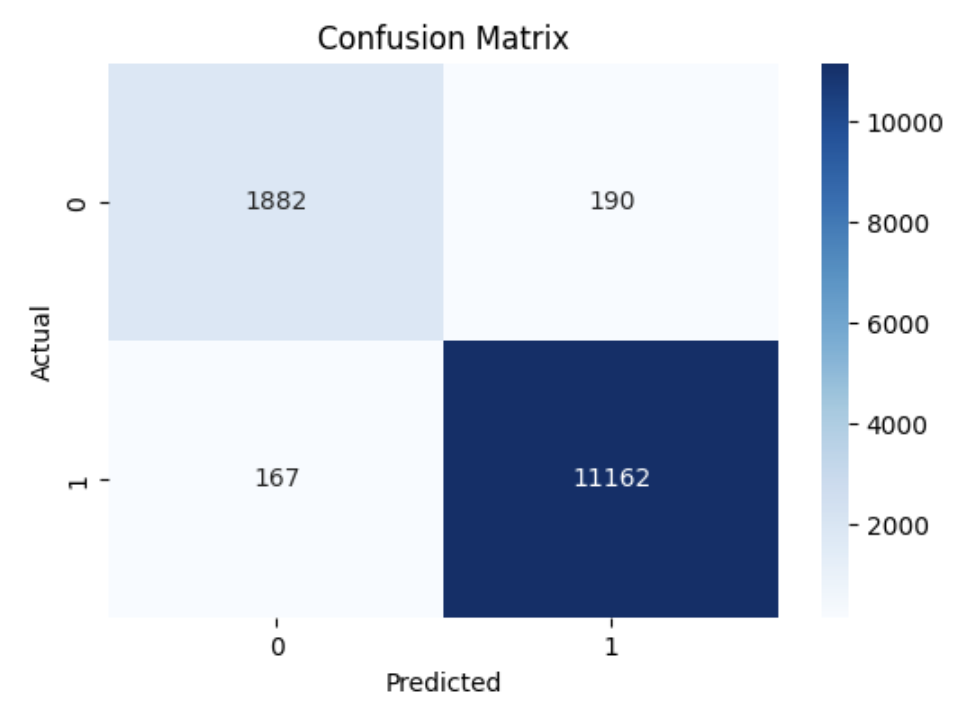

Besides, we also deployed SHAP values to analyze the model output for the test dataset. The following are examples of policies labeled by the model. The predicted label is highlighted in the top (Label 0: Non-protectionist, Label 1: Protectionist). The red terms are the most related to the predicted label:

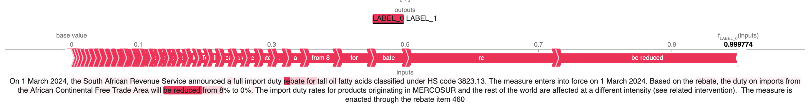
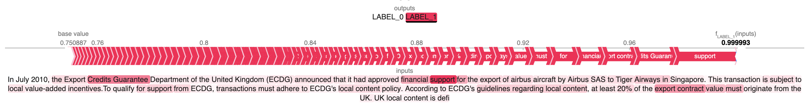
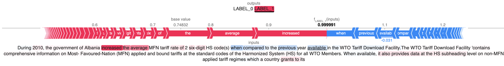

## **5) Results**
### **5.1) TF-IDF and Topic Modeling**
The TF-IDF analysis in the images below reveal that regions like Eastern Asia, Southern Asia, Southern Europe, and Western Europe had "competition" as their top TF-IDF term. For North America, it was in the second position, losing only for "research". It is also interesting to notice that the top TF-IDF term for Middle and Southern Africa was China - which suggests growing mentions of Chinese action in the region - and that the continent was the only one with "cooperation" as one of their top 10 terms.
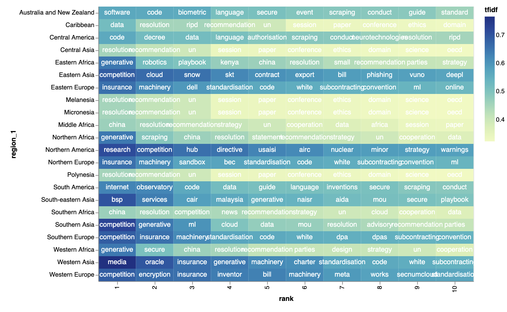
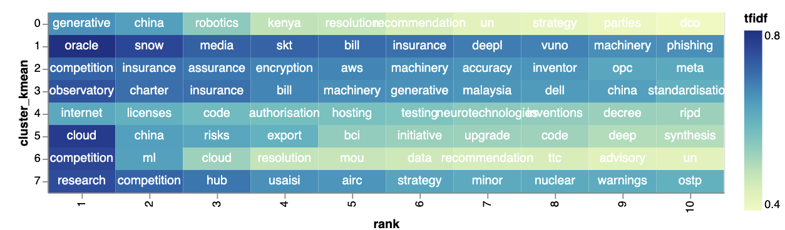

The topic modeling approach revealed 8 main topics:
- 🥷 Topic 1: Data protection - data protection personal information processing authority training privacy user consent
- 💸 Topic 2: Competition and trade - market competition commission service consumer financial company trade issue product
- 🧑‍🤝‍🧑 Topic 3: Rights - bill would introduce right require decision individual automate include establish
- 📈 Topic 4: Development - development aim digital framework national support promote research strategy international
- 🏛️ Topic 5: Law and regulation - service regulation include require provider law authority must implement provide
- ⛔ Topic 6: Risk - risk include guideline ensure model address development principle safety consultation
- 🦺 Topic 7: Safety - security cloud cybersecurity standard service national draft control compute infrastructure
- 🗨️ Topic 8: Content generation - content platform generative generate medium online copyright work digital image

Their distribution through regions follows the heatmap below:
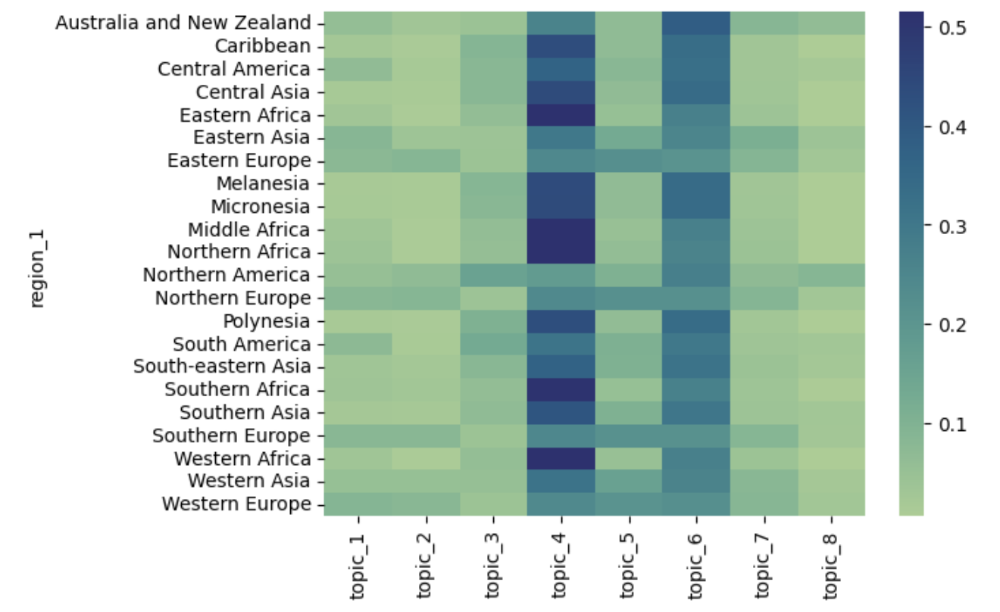

Topics 4 and 6 were the most prevalent among all regions, which shows the dual nature of AI - it is a major tool for economic development but poses risks that must be addressed by society. Topic 2 is the only one with close ties to protectionism, and its distribution among regions suggests that those concerns are more present in Europe. It is important to note, though, that topic 2 does not necessarily reflect protectionism, as the terms "competition", "trade", and "market" can also be used in liberalizing ways.

Their distribution through clusters follows the heatmap below:
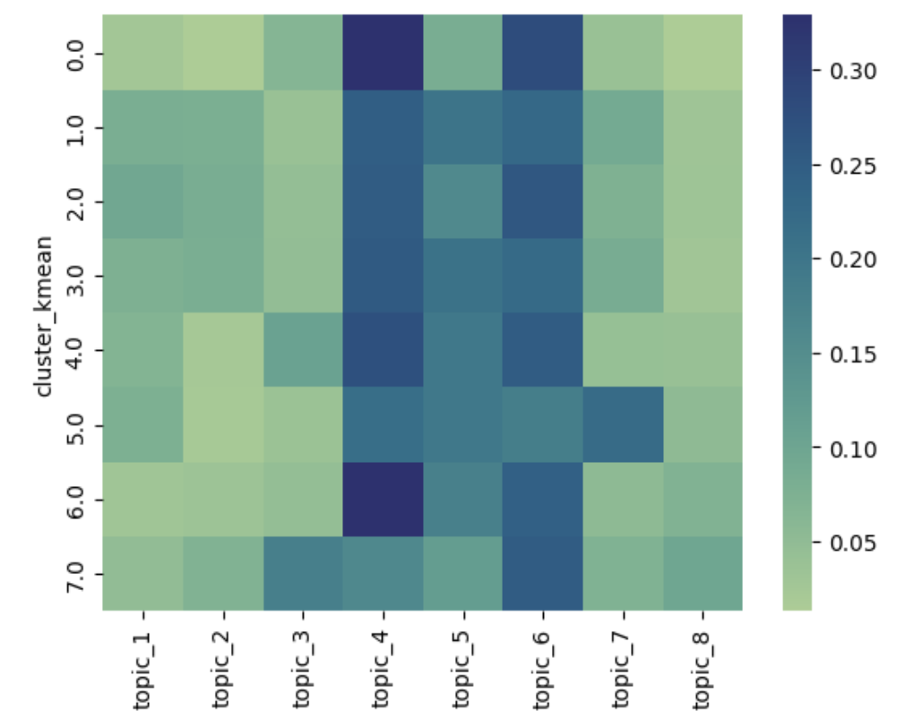

### **5.1) Classification model performance for the DPA dataset** 
The model was then applied to classify AI-related policy measures sourced from the Digital Policy Alert database. SHAP (SHapley Additive exPlanations) values were utilized to explain individual predictions, attributing importance to specific features or phrases in the text. This step provided transparency into the model’s decisions, highlighting keywords or contextual cues that influenced protectionist classifications.
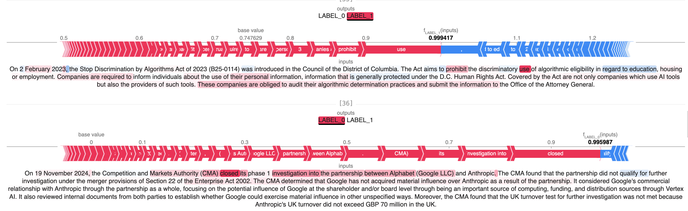
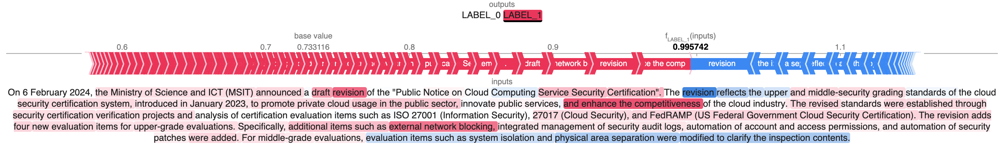
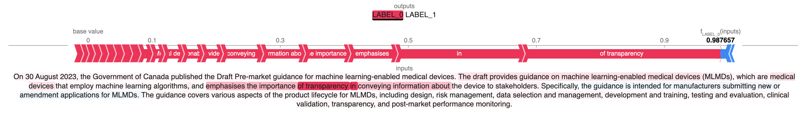

### **5.2) Where are protectionist policies deployed the most?** 
#### **5.2.1) By geographic region**
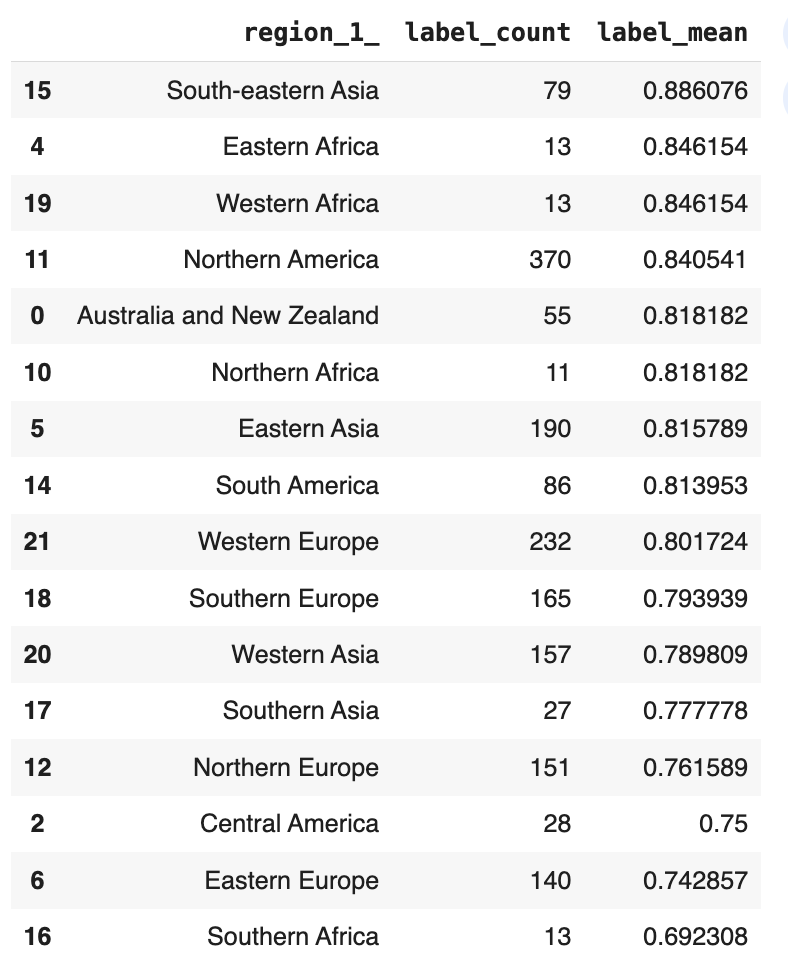

#### **5.2.2) By cluster**
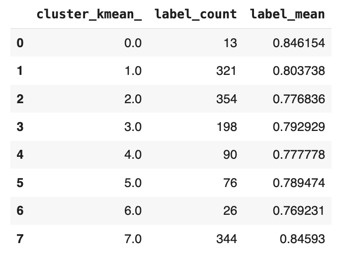

### **5.3) What are the main policy instruments used to express AI protectionism across the world?**
#### **5.2.1) By policy area**
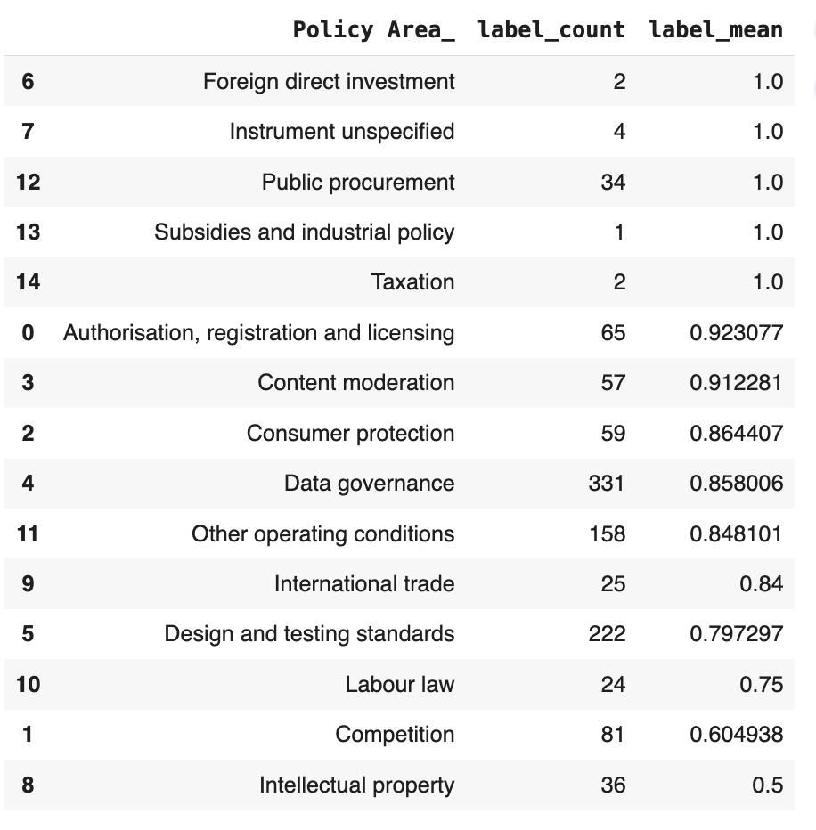

#### **5.2.2) By policy instrument**
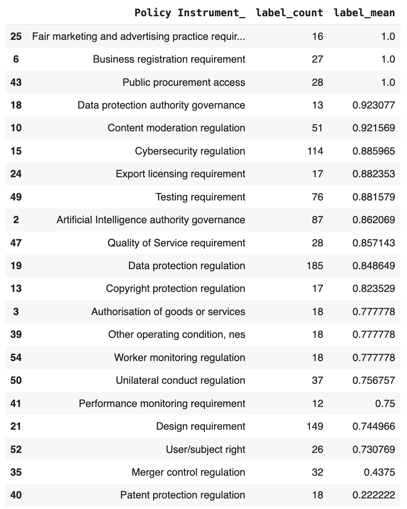

## Conclusions and next steps 
The convergence of artificial intelligence and economic nationalism signals a transformative trend in global governance, trade, and technological development. This project’s analysis, leveraging natural language processing techniques and advanced classification models, has provided nuanced insights into how protectionist rhetoric and measures are embedded within AI policy frameworks worldwide. The results reveal regional variation in the prevalence of protectionist policies, with Western, Eastern and Southern Asia emerging as the most protectionist, while regions like South America and Africa showed minimal engagement with such measures.

Further research is necessary to expand the model devised here. Three possible approaches would be to include country-level analyses, time series analyses, and other correlational assessments, such as investigating the correlation between the maturity of the AI sector in a country and its level of protectionism. Regarding the model itself, it would be crucial to pursue higher levels of robustness; one option would be to invert what was done in section 3.2. Instead of using the GTA dataset to infer which policy is protectionist, one could use the DPA dataset to infer whether a policy is related to the AI sector, and then deploy it to identify which policies are related to the sector in the GTA dataset. However, an important limitation for this approach is that it does not quantify the intensity of the protectionist policy adopted: whether it is a 100% tariff or a 5% tariff on a certain product, it still counts as the same. 

There is still a lot to be done to advance this agenda, but the findings here already highlight important facts. First, it shows that policy struggles with AI policy's dual nature: as a tool for economic development and innovation and as a source of geopolitical and economic tension. It also demonstrates that terms like "competition" appear as weak indicators of protectionism and that more robust models can classify policies based on contextual cues, offering a more robust understanding of the strategies employed by governments. And finally, it showcases a clear picture of tech-driven protectionism, which should be further studied.

## References
1. Reinert KA. Techno-Nationalism. In: The Lure of Economic Nationalism: Beyond Zero Sum. Anthem Press; 2023:137-156.
2. Juhász, R., Lane, N., Oehlsen, E., & Pérez, V. C. (2022). The who, what, when, and how of industrial policy: A text-based approach. What, When, and How of Industrial Policy: A Text-Based Approach (August 15, 2022).
